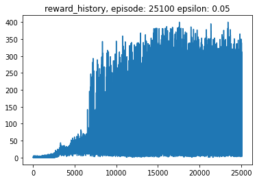

## AI
> Created Date : 2020-08-20, Last Update : 2020-09-04<br>
> Writer : Nemo (nemo-algorithm AT korea.ac.kr)

---

IELab에서 학부연구생으로 공부하며 구현한 **코드**를 올리는 저장소입니다.

인턴 세미나에서 발표한 내용은 설명은 [이 링크](https://github.com/Intelligence-Engineering-LAB-KU/Seminar/tree/master/summer_2020/intern1)에 있습니다.

---

#### 1. RNN (with numpy)

> numpy

**Result**

```
VOLUMNIA NOLANUS:
Pemensent so he is omsmecome of gord.
If the possid them; and, juct of Now; Now you high way 'WIUMBYALAS:
I am it fames, gell nothind to bldees your lance.

LORDUSENIUS:
First thee: showes, Evencess? your worthy sparent harge your shower the country we cannot peagred, proch theing ours?

MERCUTIO:
My prize of man a demenn, I kindss malmmess. Who dreast do dear comeing lown but as stees of badnen shall their Jolant, her day mother of of my still their tere love
```


---

#### 2. MountainCar-v0 (Q-Learning)

> gym


---

#### 3. Atari (DQN)

> gym, PyTorch, wandb

**Result** (BreakoutDeterministic-v4, 3 days)




---

